# Smart DCA Automation (Multi-Symbol Analysis + Execution)

A complete system that automatically analyzes market data to find the best time of day to buy for **multiple cryptocurrencies**, and then executes trades automatically on your configured exchange.

The system consists of the following files:

| File | Role |
|------|------|
| `bitkub_client.py` | Shared API client — HMAC signing, server-time sync, FX rates. Used by all other modules. |
| `crypto_analysis.py` | Daily market analysis using CCXT + Gemini AI. Updates `DCA_TARGET_MAP` with optimal buy times. |
| `crypto_dca.py` | Trade executor — reads `DCA_TARGET_MAP`, places market buy orders, logs to Gist + Ghostfolio. |
| `portfolio_balance.py` | Portfolio reporter — fetches balances, calculates THB/USD value, sends Discord report. |
| `portfolio_logger.py` | Logs individual trades to Ghostfolio portfolio tracker. |
| `gist_logger.py` | Appends trade records to a GitHub Gist as a markdown ledger. |
| `discord_bot.py` | Discord bot — natural language control of workflows and DCA config. Runs separately. |

**Workflows** (`.github/workflows/`):

1. **`crypto_analysis.yml`** — Runs daily (06:00 BKK / 23:00 UTC). Analyzes **60 days** of price data across **4 periods** (14, 30, 45, 60 days) for **all pairs in `DCA_TARGET_MAP`** to find the "Champion Time" for each. Uses AI synthesis to pick optimal buy time. Updates `DCA_TARGET_MAP`.
2. **`daily_dca.yml`** — Triggered on **manual dispatch** only. Checks if current time matches target time for any enabled symbol. Executes market buy orders.
3. **`portfolio_check.yml`** — Runs **monthly on the 5th at 07:00 BKK** (00:00 UTC). Fetches balances for all configured coins, calculates portfolio value in THB and USD, includes the previous month's trade history (5th-to-5th window), sends Discord report. Also runs on every push to main (short balance-only report).

## System Orchestration

```mermaid
flowchart LR
    subgraph TRIGGERS["⚡ Triggers"]
        T1["🕕 Daily 06:00 BKK\ncron"]
        T2["📅 Monthly 5th 07:00 BKK\ncron"]
        T3["📤 Push to main"]
        T4["⏰ External cron\nevery ~15 min"]
        T5["👤 Manual / Discord Bot"]
    end

    subgraph WORKFLOWS["🔄 GitHub Actions Workflows"]
        W1["crypto_analysis.yml\n(Analysis)"]
        W2["daily_dca.yml\n(Trader)"]
        W3["portfolio_check.yml\n(Portfolio)"]
    end

    subgraph OUTPUTS["📤 Outputs"]
        O1["💬 Discord\n(AI summary / full analysis)"]
        O2["🗄️ DCA_TARGET_MAP\n(optimal buy times updated)"]
        O3["💬 Discord\n(trade confirmation)"]
        O4["📓 GitHub Gist\n(trade ledger)"]
        O5["📊 Ghostfolio\n(portfolio activity)"]
        O6["💬 Discord\n(full monthly report)"]
        O7["💬 Discord\n(short balance report)"]
    end

    T1 -->|"all symbols"| W1
    T5 -->|"specific symbol optional"| W1
    W1 --> O1
    W1 --> O2

    T4 -->|"dispatch API"| W2
    T5 --> W2
    W2 --> O3
    W2 --> O4
    W2 --> O5

    T2 -->|"full report"| W3
    T5 -->|"configurable"| W3
    T3 -->|"short report"| W3
    W3 --> O6
    W3 --> O7
```



## Features

- **Multi-Symbol Support**: Analyze and trade multiple pairs independently (e.g., BTC at 23:00, LINK at 23:45).
- **Self-Optimizing**: Buy time adjusts daily based on 60-day historical analysis with AI-powered recommendations.
- **Configurable Report Verbosity**: Analysis workflow supports short (AI summary only) or full (detailed breakdown) Discord reports.
- **Portfolio Balance Tracking**: Automatic monthly balance checking and reporting via Discord with real-time valuations in THB and USD. Short balance-only report on every push to main.
- **Multi-Layer Safeguards**: Prevents double-buying with `LAST_BUY_DATE` tracking and workflow concurrency control.
- **Detailed Logging**: All trades logged to GitHub Gist with THB and USD amounts for portfolio tracking.
- **Portfolio Integration**: Automatic trade logging to Ghostfolio portfolio tracker with 8-decimal precision and timezone-aware timestamps.
- **Discord Integration**: Real-time notifications for trades (with THB+USD amounts and Ghostfolio status), errors, and critical alerts including FX rate failures.
- **Timezone Aware**: Fully configurable timezone support via `TIMEZONE` env variable (defaults to Asia/Bangkok).
- **Non-Blocking Logging**: Trade execution succeeds even if Gist or Ghostfolio logging fails (errors logged and notified).

### 1. Secrets (Secure Storage)
Go to `Settings` -> `Secrets and variables` -> `Actions` -> `New repository secret`:

| Secret Name | Value Description |
| :--- | :--- |
| `BITKUB_API_KEY` | Your exchange API Key. |
| `BITKUB_API_SECRET` | Your exchange API Secret. |
| `GEMINI_API_KEY` | Google AI Studio Key. |
| `DISCORD_WEBHOOK_URL` | Your Discord Webhook URL. |
| `GH_PAT_FOR_VARS` | Personal Access Token (Classic) with `repo` and **`gist`** scope. Used to update variables and write to your log. |
| `GIST_TOKEN` | (Same as GH_PAT_FOR_VARS) Token used specifically by the python script to update Gists. |
| `GIST_ID` | The ID of your `trade_log.md` gist. |
| `GHOSTFOLIO_TOKEN` | Your Ghostfolio access token for portfolio logging. |

### 2. Variables (Configuration)
Go to `Settings` -> `Secrets and variables` -> `Actions` -> `New repository variable`:

| Variable Name | Example Value | Description |
| :--- | :--- | :--- |
| `DCA_TARGET_MAP` | `{"BTC_THB": {"TIME": "07:00", "AMOUNT": 800, "BUY_ENABLED": true, "LAST_BUY_DATE": ""}}` | **Key config.** Dictionary mapping Symbol to settings (Time, Amount, Enabled, LastBuy). |
| `TIMEZONE` | `Asia/Bangkok` | Timezone for operations. |
| `PORTFOLIO_ACCOUNT_MAP` | `{"BTC": "3cced5d3-f219-47c8-bb73-878466060d7a", "DEFAULT": "9069984b-3c2b-48d8-831d-b7d73b5bafb7"}` | Maps crypto symbols to Ghostfolio account IDs. Falls back to DEFAULT if symbol not found. |
| `GHOSTFOLIO_URL` | `https://ghostfol.io` | Ghostfolio instance URL (optional, defaults to https://ghostfol.io). |

### 3. Workflow Configuration

**Analysis Workflow (`crypto_analysis.yml`)**:
- **Schedule**: Daily at 23:00 UTC (06:00 Bangkok)
- **Trigger**: Daily schedule or manual dispatch
- **Concurrency**: Only one analysis runs at a time (cancel-in-progress)
- **Environment**: Uses `binanceus` exchange to avoid geo-restrictions
- **Symbol Resolution**: Automatically derives symbols from `DCA_TARGET_MAP` keys (e.g., `BTC_THB` → `BTC/USDT`). Override with explicit `symbol` input on manual dispatch.
- **Report Mode**: Configurable via `short_report` input (default: true)
  - **Short Report (true)**: Sends AI summary only (~8 lines) - ideal for daily automated runs
  - **Full Report (false)**: Sends detailed analysis with all time period breakdowns - use for deep dives

**Trader Workflow (`daily_dca.yml`)**:
- **Trigger**: **Manual dispatch ONLY** (no automatic cron schedule by design). Triggered via GitHub Actions UI or workflow_dispatch API
- **Concurrency**: Only one trade workflow runs at a time (queued, not cancelled)
- **Pre-Check**: Bash Quick Check runs first (no checkout/Python needed). Only checks out code and installs dependencies if a trade is needed
- **Safeguards**: Multiple layers check `BUY_ENABLED`, `LAST_BUY_DATE`, and time window
- **Rationale**: Manual dispatch gives you full control over when trades execute. Analysis updates DCA_TARGET_MAP daily, but you decide when to run the trader

**Portfolio Balance Workflow (`portfolio_check.yml`)**:
- **Schedule**: Monthly on the 5th at 07:00 Bangkok time (00:00 UTC)
- **Trigger**: Also runs on every push to main + manual dispatch available
- **Optimized**: Only installs minimal dependencies (requests library), uses pip caching for speed
- **Report Mode**: Adaptive based on trigger
  - **Short Report (push)**: Current holdings and total value only - fast status check
  - **Monthly Full Report (5th)**: Current holdings plus the exact previous month's trade history (5th 07:00 BKK → 5th 07:00 BKK)
  - **Manual dispatch (GitHub Actions UI)**: Full monthly report by default (`short_report` input defaults to `false`)
  - **Manual dispatch (Discord Bot)**: Short report by default — say "full portfolio" or "portfolio with trades" for the full monthly report
- **Report**: Fetches balances for all coins in DCA_TARGET_MAP, calculates portfolio value, sends Discord notification

## How It Works

### Daily Analysis Cycle


1. At 06:00 Bangkok time, `crypto_analysis.yml` triggers
2. Resolves symbols from `DCA_TARGET_MAP` keys (e.g., `BTC_THB` → `BTC/USDT`, `LINK_THB` → `LINK/USDT`, `SUI_THB` → `SUI/USDT`). Can be overridden via explicit input.
3. Fetches 60 days of 15-minute OHLCV data from Binance for each symbol
4. Calculates metrics: `median_miss`, `win_rate`, `dca_price` for each 15-min slot
5. Gemini AI synthesizes recommendation across 14/30/45/60-day periods
6. Sends Discord report (short AI summary by default, full analysis if configured)
7. Updates `DCA_TARGET_MAP["<SYMBOL>_THB"]["TIME"]` with optimal buy time for each pair

### Trade Execution Cycle

```mermaid
flowchart TD
    A["⏰ Trigger\nexternal cron every ~15 min\nOR manual dispatch"] --> B["⚡ Bash Quick Check\nno checkout required"]
    B --> C{Any symbol has\nBUY_ENABLED=true\nand LAST_BUY_DATE ≠ today\nand time match?}
    C -->|No match| D["🛑 Exit immediately\n0 resources used"]
    C -->|Match found| E["Checkout repo\nSetup Python\nInstall deps"]
    E --> F["Python validation\ntime window ±5 min\nor catch-up mode"]
    F --> G{Already bought\ntoday?}
    G -->|Yes| H["Skip symbol"]
    G -->|No| I["Place market bid\nBitkub API"]
    I --> J["Wait 5s for fill\nFetch order details"]
    J --> K["Fetch THB→USD rate\nfor logging"]
    K --> L["Log to Ghostfolio\nnon-blocking"]
    K --> M["Log to GitHub Gist\nnon-blocking"]
    L --> N["Send Discord alert\n✅ trade details + Ghostfolio status"]
    M --> N
    N --> O["Update LAST_BUY_DATE\nin DCA_TARGET_MAP\n3 retries — fails loudly"]
```



1. **Manual trigger** via GitHub Actions UI (Actions tab → Daily Crypto DCA → Run workflow) or workflow_dispatch API call
2. **Bash Quick Check** (no checkout/Python required): Filters by `BUY_ENABLED`, `LAST_BUY_DATE`, time window
3. If no match → Workflow ends (fast exit, no resources used)
4. If match found → Checkout repo → Setup Python → Install deps → Run Python
5. **Python**: Validates time window (±5 min or catch-up), checks `LAST_BUY_DATE`
6. Places market bid order (waits 5 seconds for fill)
7. Fetches THB→USD exchange rate for logging
8. **Logs to Ghostfolio** (non-blocking): Authenticates with 30s timeout, creates activity with 8-decimal precision, maps symbol to account (falls back to DEFAULT)
9. **Logs to Gist** (non-blocking): Records trade with THB+USD amounts and Ghostfolio save status
10. Sends Discord alert with trade details and Ghostfolio status
11. Updates `LAST_BUY_DATE` with 3 retries (fails loudly on error)

**Why Manual Dispatch?**: The system intentionally has NO automatic cron schedule on the trader workflow. This gives you complete control over trade execution timing. While analysis runs daily to update optimal buy times, you decide when to actually execute trades.

**Automating the trigger (optional)**: To run the trader automatically every 15 minutes without adding a cron schedule to the workflow itself, you can call the `workflow_dispatch` API externally:
- **Local cron job**: Add a crontab entry on any always-on machine: `*/15 * * * * curl -s -X POST -H "Authorization: token YOUR_PAT" -H "Accept: application/vnd.github.v3+json" https://api.github.com/repos/YOUR_USER/YOUR_REPO/actions/workflows/daily_dca.yml/dispatches -d '{"ref":"main"}'`
- **Online cron service**: Use [cron-job.org](https://cron-job.org/en/) (free) — point it at the same GitHub API URL above with your PAT in the `Authorization` header, scheduled every 15 minutes. The workflow's Bash Quick Check will exit immediately if no trade is due, so unnecessary triggers are near-free.

## Portfolio Balance Reporting

The balance checker provides automated portfolio tracking and valuation:

```mermaid
flowchart TD
    A1["📅 Monthly cron\n5th at 07:00 BKK"] -->|SHORT_REPORT=false| C
    A2["📤 Push to main"] -->|SHORT_REPORT=true| C
    A3["👤 GitHub Actions UI\nmanual dispatch"] -->|SHORT_REPORT=false default| C
    A4["🤖 Discord Bot"] -->|"SHORT_REPORT=true default\n(false if full requested)"| C

    C["Fetch live wallet balances\nBitkub /api/v3/market/balances"]
    C --> D["Fetch current prices\nBitkub TradingView API"]
    D --> E["Fetch THB→USD rate\n(2-source fallback)"]
    E --> F["Build CURRENT HOLDINGS\nbalance × price for each coin\nTHB + USD values"]
    F --> G{SHORT_REPORT?}
    G -->|true| H["Send short Discord report\nHoldings + total value only"]
    G -->|false| I["Compute 5th-to-5th window\nstart_dt = prev month 5th 07:00 BKK\nend_dt = this month 5th 07:00 BKK"]
    I --> J["Fetch order history\nlimit 200 per coin\nfilter: buy + within window"]
    J --> K["Build TRADE HISTORY\nper-coin totals + individual trades\nhistorical FX rate per trade"]
    K --> L["Send full Discord report\nHoldings + trade history"]
```



### Features
- **Multi-Coin Support**: Automatically fetches balances for all coins in `DCA_TARGET_MAP`
- **Real-Time Pricing**: Gets current market prices from Bitkub API
- **Dual Currency**: Shows values in both THB and USD
- **Configurable Report Verbosity**: Short (balance only) or full (with trade history)
- **Automated Reports**: Monthly full report on the 5th + short balance-only report on every push to main
- **Discord Notifications**: Formatted report with individual coin balances and total portfolio value

### Report Format

**Short Report** (on push):
```
📊 CURRENT HOLDINGS

BTC
  Amount: 0.00084835
  Price: ฿2,113,889.19
  Value: ฿1,793.32 ($57.41)

LINK
  Amount: 5.01449152
  Price: ฿277.11
  Value: ฿1,389.57 ($44.48)

💰 Total Portfolio Value
฿3,182.88
$101.89
```

**Full Report** (monthly schedule or manual):
Includes all of the above PLUS:
```
════════════════════════════════════════
📈 TRADE HISTORY (Feb 05 → Mar 05, 2026)

BTC (19 trades) — Crypto amount: 0.00446910 — Spent: ฿6,949.95 ($223.75)
• 2026-03-04 23:00 +07 - 0.00042594 BTC - Order ID: 69a04e8a93 - Price: ฿2,112,938.03 ($68,036.60) - Spent: ฿899.99 ($28.98)
...

LINK (10 trades) — Crypto amount: 14.66775216 — Spent: ฿2,400.00 ($77.24)
• 2026-03-04 23:45 +07 - 1.04260791 LINK - Order ID: 69a04e9aa0 - Price: ฿287.74 ($9.27) - Spent: ฿300.00 ($9.66)
...
```

### Schedule
- **Monthly (Full Report)**: Every 5th of the month at 07:00 Bangkok time - includes exact 5th-to-5th trade history
- **On Push (Short Report)**: After every commit to main branch - balance only for quick checks
- **Manual (Short Report by default)**: Can be triggered via GitHub Actions UI or Discord bot — shows balance only unless full report is explicitly requested

## Currency Conversion

The system fetches real-time THB→USD exchange rates from multiple sources:
- **Primary**: Frankfurter API (`api.frankfurter.app`)
- **Secondary**: Open Exchange Rate API (`open.er-api.com`)
- **Fallback**: If all sources fail, USD values show as `$0.00` and an error notification is sent to Discord

## Portfolio Logging

Trades are automatically logged to Ghostfolio for portfolio tracking:
- **Account Mapping**: Maps crypto symbols to Ghostfolio accounts via `PORTFOLIO_ACCOUNT_MAP` (falls back to DEFAULT)
- **Precision**: 8-decimal quantity formatting (e.g., 0.00012345 BTC)
- **Comment Format**: `฿800.00 - $25.10 - tx_abc123de` (shows THB, USD, and exchange order ID)
- **Data Source**: Yahoo Finance (BTCUSD, LINKUSD, etc.) - free tier compatible
- **Timezone Support**: Uses configured TIMEZONE, converts to UTC for Ghostfolio
- **Timeout**: 30 seconds for all Ghostfolio API requests (doubled from standard)
- **Error Handling**: Non-blocking - trade executes even if Ghostfolio fails (errors logged to console and Discord)
- **Gist Integration**: "Saved" column reflects Ghostfolio logging success (`true`/`false`)

## Safeguards Against Double-Buying

| Layer | Location | Check | Prevents |
|-------|----------|-------|----------|
| **Concurrency** | GitHub Actions | Only 1 workflow runs at a time | Race conditions |
| **Bash Filter** | Quick Check step | `LAST_BUY_DATE == today` | Unnecessary Python execution |
| **Python Filter** | Symbol processing | `BUY_ENABLED == false` | Disabled symbols |
| **Time Window** | `is_time_to_trade()` | Within ±5 min or catch-up | Out-of-window execution |
| **Date Check** | Per-symbol loop | `LAST_BUY_DATE == today` | Same-day duplicate |
| **API Update** | Post-trade | 3 retries, fail loudly | Silent failure risk |

## Discord Bot (Natural Language Control)

A self-hosted Discord bot (`discord_bot.py`) that lets you control the DCA system via natural language chat.

### Capabilities
- **Trigger Analysis**: "Run analysis" (analyzes all symbols in DCA config) / "Analyze BTC" (specific symbol)
- **Check Portfolio**: "Show balance" / "Portfolio report"
- **View Config**: "Show status" / "What's the current config?"
- **View Accounts**: "Show accounts" / "Portfolio account map"
- **Update DCA Config**: "Set BTC amount to 600" / "Set BTC time to 22:00" / "Disable LINK"

All commands are interpreted via Gemini AI — just type naturally.

### Setup

1. **Create a Discord Application** at [discord.com/developers](https://discord.com/developers/applications)
2. Under **Bot** settings, enable **Message Content Intent**
3. Generate a **Bot Token** and invite the bot to your server (Send Messages, Read Messages permissions)
4. Install dependencies: `pip install -r bot_requirements.txt`
5. Set environment variables and run:

```bash
export DISCORD_BOT_TOKEN="your-bot-token"
export GEMINI_API_KEY="your-gemini-key"
export GH_PAT="your-github-pat"           # Same PAT as GH_PAT_FOR_VARS (repo scope)
export GITHUB_REPO="owner/repo"            # e.g. "simon/DCA-Analysis"
export DISCORD_CHANNEL_ID="123456789"      # Optional: restrict to one channel
export DISCORD_ALLOWED_USERS="111,222"     # Optional: restrict to specific Discord user IDs

python discord_bot.py
```

### Behaviour
- **With `DISCORD_CHANNEL_ID` set**: Bot responds to all messages in that channel
- **Without it**: Bot only responds to @mentions and DMs
- **With `DISCORD_ALLOWED_USERS` set**: Only listed user IDs can trigger actions
- **DCA updates are validated**: AMOUNT must be 20–1000 THB, TIME must be HH:MM, BUY_ENABLED must be bool. Cannot add/remove symbols — only update existing ones.

### Hosting
The bot runs separately from GitHub Actions — anywhere with Python 3.9+ and internet:
- Local machine / Raspberry Pi
- Free tier: [Railway](https://railway.app), [Render](https://render.com), [Fly.io](https://fly.io), [Oracle Cloud free VM](https://www.oracle.com/cloud/free/)

